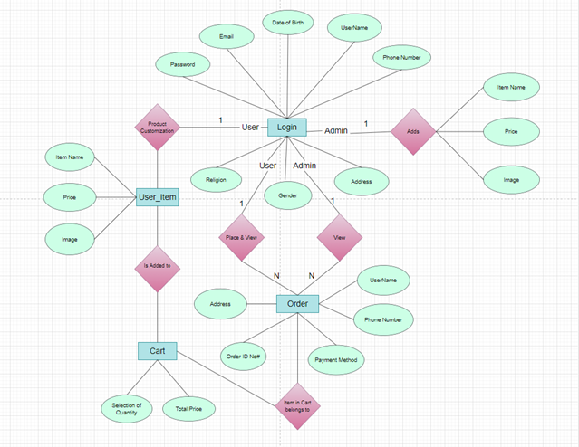
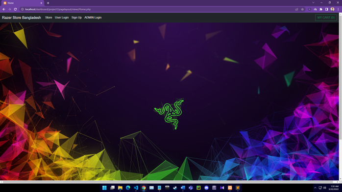
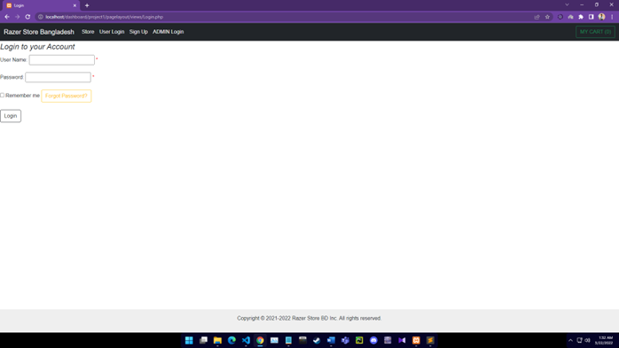
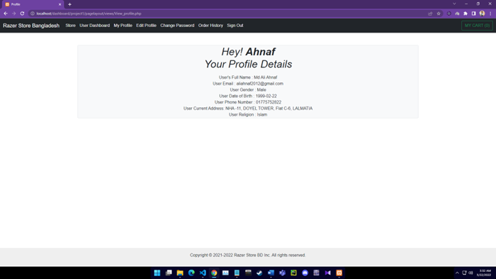
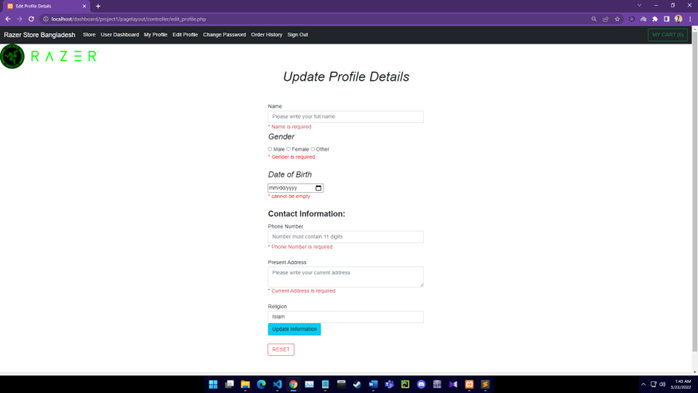
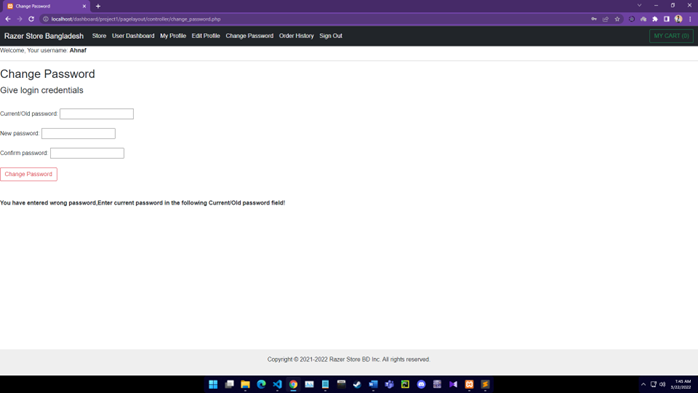
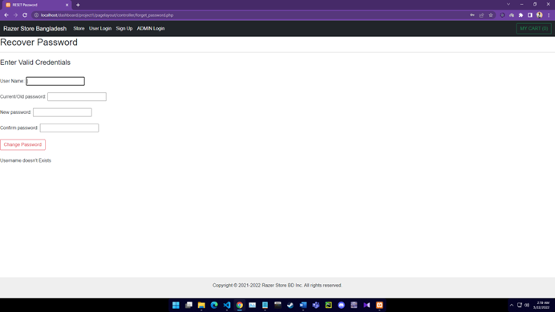
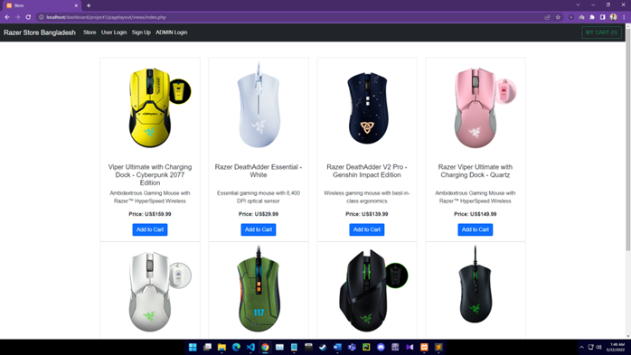
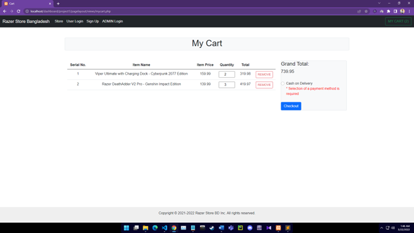
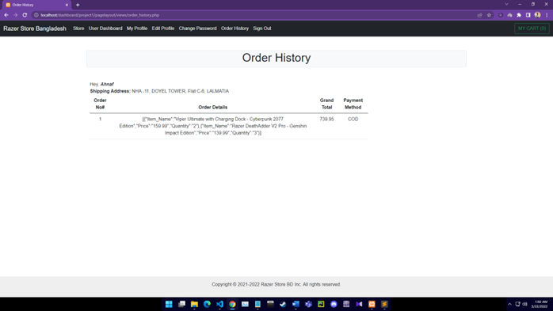

                        >>>>>>>>>>> Website Name: Razer Store Bangladesh <<<<<<<<<<<

Project Description:
# Razer-Store-Bangladesh_JSON-Database
The purpose of the project is to deliver authentic Razer products (which is shipped from the US) through a user-friendly, strong security, reliable purchase system which will be provided through the webpage Razer Store Bangladesh. Therefore, not only gamers, office-workplace users but also the people who seek for authentic razer products at a reasonable price can purchase without any hesitation or discomfort. The webpage is secured through proper PHP-validation and the resources are protected via appropriate Session-Cookie implementation.

Background Study:
From several different websites and through various sources observation and study proper concept was gathered and implemented. 
The following sources and websites which were used as reference for the project are demonstrated ascendingly:

•	Razer Store USA: From this website, page layout idea was taken. Moreover, the layout of the items/products idea was also taken. Website link: https://www.razer.com/store

•	TJ WEBDEV: From this website, payment checkout, product add/remove, and header’s navigation-bar concept was taken. Website link: https://tjwebdev.in/

Requirement Analysis:

1.	User Category:

There are currently 2-types of Users here. They are:

•	User / Customer
•	Additional: Admin

2.	Feature List:

In this project the “User / Customer” has the following features:

•	Sign Up/ Registration.
•	User Login.
•	View Profile.
•	Edit Profile.
•	Change Password.
•	Forget Password.
•	Without login with proper username and password cannot access to account by using session which is protecting the resource. Moreover, after logout session ends hence user needs to login again to gain access to the account.
•	Remember me while login using Cookie which is only stored for 10 second time interval.
•	Can view the products in the store.
•	Adding products to the cart which gets updated and can select the desired quantity of the products which user wants to purchase.
•	User can check out his payment where he can pay total amount of the product via cash on delivery.
•	Lastly, Order and Payment history of his purchase can be viewed through his account via logging.

In this project the “Admin” has the following features:

•	Sign Up/ Registration.
•	Admin Login.
•	View Profile.
•	Edit Profile.
•	Change Password.
•	Forget Password.
•	Without login with proper Admin name and password cannot access to account by using session which is protecting the resource. Moreover, after logout session ends hence user needs to login again to gain access to the account.
•	Remember me while login using Cookie which is only stored for 10 second time interval.
•	Insert, Update, Delete of User’s data

Design:
 

Tools Used:

To develop this project, we have used the following:

•  ApacheFriends XAMPP Version 7.4.27	
• Apache 2.4.52
• PHP 7.4.27 (VC15 X86 64bit thread safe) + PEAR
• XAMPP Control Panel Version 3.3.0.
• Bootstrap v5.0	.
• Sublime Text 4 (Build 4126)
• Visual Studio Code Version 1.65

System Images against the Specification:

 

This is the homepage of Razer Store Bangladesh.

 

User can login with proper and valid credentials to gain access.

 

After logging in user can view the details of their profile.

 

User can update his profile data after logging in.

 
User can change their password via inserting previous password of their account. In this segment login to the account is required.
 
 

If the user forgets password, to gain access to the account password can be recovered by resetting.
In this segment user needs to provide valid and proper credentials likely Username and previous password of the account.

 

User can choose their desired products from the store which will automatically be added to the cart.
N.B. User can’t add the same item more than once.
 

In the cart user can select the quantity of their desired item and also can remove items. Grand total will generate automatically upon item price respected to its price. After selecting Payment Method User can proceed for checkout.

 

Lastly after checkout, in this page user can see their Order history that was placed according to its order ID No#.

Impact of this Project:

In this modern era purchasing products through online shopping platform is a great advantage. Nowadays mostly buyer’s prefer online shopping over conventional shopping. The buyer’s decision-making process has changed dramatically in recent years. Buyers are conducting extensive research online before ever speaking to a salesperson. Buyers are also making more direct purchases online and via their smartphone, never stepping foot into traditional brick-and-mortar locations. The internet makes doing business much easier and faster. It’s led to changes in the way people do business with a rapidly growing worldwide trend towards online shopping or e-commerce.

The following benefits people will get:

•	Authentic US Razer Products/Peripherals.
•	Convenience: From anywhere in the country can purchase product with ease.
•	Hassle-free, User-friendly purchase.
•	Fast delivery of products.
•	Secured purchase and secured user data information.
•	Save time. 
•	Availability of Wide variety / range of products.
•	Discounts / lower prices.
•	Can compare various models.

Limitations and Possible Future Improvements:

Limitations:

•	Website can have delay in loading in lower end machines.
•	There is no search button hence user can’t search the desired item through search bar.
•	There is not quite of an optimization in user mobile view and experience.
•	There is no such option for mobile user to switch to desktop view.
•	If many users use the website at a time website server response can increase.
•	There may be delay in delivery of the ordered product.
•	May have lack of discounts compared to physical stores offered discounts.
•	Lack of touch and feel of merchandise in online shopping.
•	Lack of interactivity in online shopping.
•	Lack of close examination of products in online shopping. 
•	Products can be out of stock.
•	There is lack in style, beautification and formatting of a document which is written in a markup language because there is barely any usage of CSS.

Possible Future Improvements:

•	A reliable and fast web hosting provided by data center services can be used to maintain fast server response time.
•	Optimization of Database.
•	Allowing a way to switch mobile visitors for a way to switch to Desktop View.
